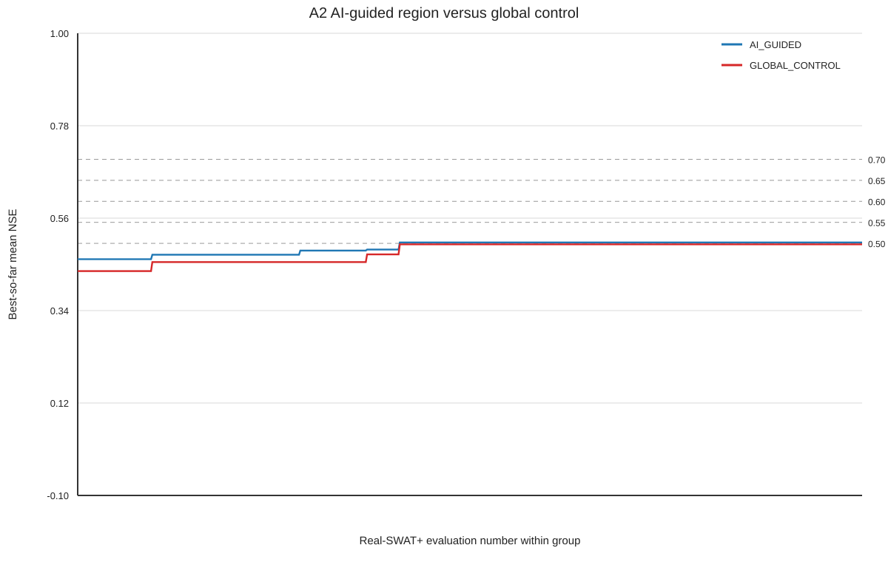

# A2 AI-Guided Search Region Test

## Scope

This is a search-region quality test only. It compares 600 AI-guided and 600 global-control fresh Real-SWAT+ rev.62 evaluations with W6. No optimizer updates online, no posterior is trained, and no subsequent A2 stage is started.

The exact same scrambled Latin-hypercube unit design (seed `20260918`) was mapped once into the AI-guided region and once into the full formal 14-D bounds. Therefore the group difference is the initial parameter region, not the sampling design or evaluation budget.

## AI-guided region

The region combines the five Transformer qobs seeds, their ensemble median, Ridge qobs theta, A1 Top1 synthetic-inverse predictions from the best 20 fixed test cases, and A1 historical best-broad parameter vectors. Each parameter has a robust median centre and a widened interval clipped to the formal bounds; the design is not locked to a single point.

| parameter | formal lower | AI lower | AI centre | AI upper | formal upper |
|---|---:|---:|---:|---:|---:|
| cn2 | -20 | -17.269418 | -4.5721283 | 5.7206055 | 10 |
| latq_co | 0 | 0 | 0.31941384 | 0.80163265 | 1 |
| lat_ttime | 0.5 | 0.5 | 77.979492 | 144.18529 | 180 |
| esco | 0 | 0.18689591 | 0.50722277 | 0.83357422 | 1 |
| epco | 0 | 0.25753139 | 0.50181502 | 0.99246094 | 1 |
| petco | 0.8 | 0.85995393 | 1.0874023 | 1.2 | 1.2 |
| alpha | 0 | 0.2258554 | 0.48489237 | 0.91638672 | 1 |
| bf_max | 0.1 | 0.38039845 | 1.0630097 | 1.4505474 | 2 |
| revap_co | 0.02 | 0.041747656 | 0.10975213 | 0.15814297 | 0.2 |
| deep_seep | 0.001 | 0.098699838 | 0.22186732 | 0.4 | 0.4 |
| surlag | 0.05 | 0.05 | 11.386323 | 21.008121 | 24 |
| chn | 0.001 | 0.070257924 | 0.15493852 | 0.27894153 | 0.3 |
| chk | 1e-05 | 83.164064 | 242.81003 | 426.21094 | 500 |
| perco | 0.8 | 0.88172249 | 0.99980468 | 1.1 | 1.1 |

## Fairness and runtime

- Device: `CPU`; physical/logical cores: `8/16`; W6 workers: `6`.
- Same executable, frozen template, development period 2003–2016, three-gauge objective, 600 evaluations per group, and identical LHS unit points.
- Completed: AI_GUIDED `600`; GLOBAL_CONTROL `600`.

## Search efficiency

| metric | AI_GUIDED | GLOBAL_CONTROL |
|---|---:|---:|
| best mean NSE | 0.5020904093265484 | 0.4976945550768203 |
| top10 mean NSE | 0.48253538180162237 | 0.4651585524512554 |
| top50 mean NSE | 0.443936420932509 | 0.40624555203410745 |
| median mean NSE | 0.2364536932621385 | 0.17995441810283558 |

| target mean NSE | AI first evaluation | Global first evaluation |
|---:|---:|---:|
| 0.5 | 247 | NOT_REACHED |
| 0.55 | NOT_REACHED | NOT_REACHED |
| 0.6 | NOT_REACHED | NOT_REACHED |
| 0.65 | NOT_REACHED | NOT_REACHED |
| 0.7 | NOT_REACHED | NOT_REACHED |

The figure plots best-so-far mean NSE against within-group Real-SWAT+ evaluation number. `NOT_REACHED` is retained as a literal result in the threshold table.

## Gate

`AI_GUIDANCE=USEFUL`; `A2_GATE=PASS`.

AI earlier thresholds: `['0.5']`; global earlier thresholds: `[]`; final best delta (AI−global): `0.004395854249728048`.

The Gate is a comparison of this fixed budget and does not claim posterior validity. A2 stops here; no posterior training or downstream calibration is authorized by this output.

## Artifact boundary

Tracked small outputs are `ai_guided_region.json`, `results.csv`, `A2_GATE.json`, this report, `best_so_far_nse.png`, and `best_so_far_nse.svg`. Daily qsim arrays and runtime checkpoint/scratch files remain local and are excluded from Git.
