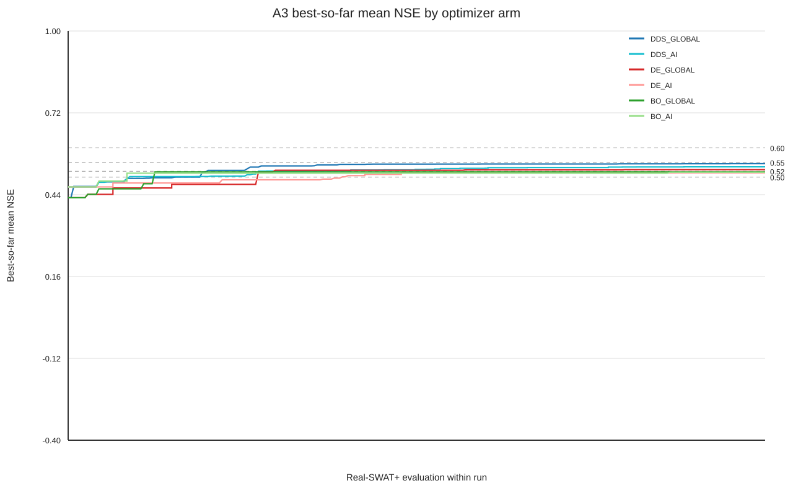

# A3 AI-Guidance × Optimizer Efficiency Benchmark

## Scope and freeze

This is the formal A3 efficiency experiment. It uses only the A0 development observation tensor for 2003-2016 (5114 daily rows at three gauges), the inherited SWAT+ rev.62 executable/workflow, and the frozen A2 AI-guided region. Validation 2017-2020 and final test 2021-2024 were not loaded. A2 objective results and historical optimizer traces were not used for warm starts.

Baseline commit: `b2955b4a311ebbba87b079052e9eb5911c6c86a4`; code commit at run: `0789655da0737915c847192fe5604a651e7cdc88`. Frozen A2 region SHA-256: `b118b549611cf9c065090d1617267ccfa66d86f5f204628a0566393ea3e76d2d`.

## Design

There are 18 runs: DDS, DE, and fixed GP-BO; each has GLOBAL and AI arms at seeds 20260903, 20260904, and 20260905. Each run has 250 sequential fresh Real-SWAT+ evaluations. At most six independent runs execute concurrently, one SWAT process and one scratch root per run. GLOBAL maps normalized [0,1]^14 to formal bounds; AI maps the same normalized coordinates to the frozen A2 bounds.

The paired GLOBAL/AI arms of each optimizer use the identical seed and initialization/random stream. DDS uses standard sequential perturbation; DE uses DE/rand/1/bin with NP=10, F=0.8, CR=0.9; BO is fixed as BoTorch SingleTaskGP with LogExpectedImprovement and a deterministic 256-point 14-D Sobol candidate pool. BO evaluates one candidate at a time and does not switch to TuRBO or another method.

## Parallel smoke test

The pre-run real smoke test completed `6` independent SWAT work directories in parallel with status `PASS`. These six engineering evaluations are excluded from the formal 4500-evaluation comparison. Smoke record: `artifacts/a3/runtime/smoke/smoke.json`.

## Frozen AI region

The A2 region remains unchanged during A3. Every interval is inside the formal bound and is sampled as a region rather than a point.

| parameter | formal lower | AI lower | AI centre | AI upper | formal upper |
|---|---:|---:|---:|---:|---:|
| cn2 | -20.000000 | -17.269418 | -4.572128 | 5.720605 | 10.000000 |
| latq_co | 0.000000 | 0.000000 | 0.319414 | 0.801633 | 1.000000 |
| lat_ttime | 0.500000 | 0.500000 | 77.979492 | 144.185293 | 180.000000 |
| esco | 0.000000 | 0.186896 | 0.507223 | 0.833574 | 1.000000 |
| epco | 0.000000 | 0.257531 | 0.501815 | 0.992461 | 1.000000 |
| petco | 0.800000 | 0.859954 | 1.087402 | 1.200000 | 1.200000 |
| alpha | 0.000000 | 0.225855 | 0.484892 | 0.916387 | 1.000000 |
| bf_max | 0.100000 | 0.380398 | 1.063010 | 1.450547 | 2.000000 |
| revap_co | 0.020000 | 0.041748 | 0.109752 | 0.158143 | 0.200000 |
| deep_seep | 0.001000 | 0.098700 | 0.221867 | 0.400000 | 0.400000 |
| surlag | 0.050000 | 0.050000 | 11.386323 | 21.008121 | 24.000000 |
| chn | 0.001000 | 0.070258 | 0.154939 | 0.278942 | 0.300000 |
| chk | 0.000010 | 83.164064 | 242.810028 | 426.210936 | 500.000000 |
| perco | 0.800000 | 0.881722 | 0.999805 | 1.100000 | 1.100000 |

## Formal result integrity

Formal rows: `4500`; successful rows: `4500`; failed rows: `0`; complete runs: `18/18`. The results table has one row per evaluation and retains theta, all three station NSE/KGE/PBIAS/RMSE values, mean/min NSE, and best-so-far mean NSE.

## Three-seed arm summaries

Best NSE is reported as mean ± sample standard deviation over the three seeds. Threshold medians and success rates are computed within each arm; `NOT_REACHED` is retained as censoring.

| arm | runs | best mean NSE (mean ± std) | best median | 0.50 median / rate | 0.52 median / rate | 0.55 median / rate | 0.60 median / rate |
|---|---:|---:|---:|---:|---:|---:|---:|
| DDS_GLOBAL | 3 | 0.533611 ± 0.013993 | 0.536119 | 68 / 1.000 | 76 / 0.667 | NOT_REACHED / 0.000 | NOT_REACHED / 0.000 |
| DDS_AI | 3 | 0.526173 ± 0.011565 | 0.530123 | 68 / 1.000 | 109 / 0.667 | NOT_REACHED / 0.000 | NOT_REACHED / 0.000 |
| DE_GLOBAL | 3 | 0.514058 ± 0.010516 | 0.511296 | 216 / 1.000 | 75 / 0.333 | NOT_REACHED / 0.000 | NOT_REACHED / 0.000 |
| DE_AI | 3 | 0.511597 ± 0.002908 | 0.510971 | 103 / 1.000 | NOT_REACHED / 0.000 | NOT_REACHED / 0.000 | NOT_REACHED / 0.000 |
| BO_GLOBAL | 3 | 0.516251 ± 0.002095 | 0.516974 | 51 / 1.000 | NOT_REACHED / 0.000 | NOT_REACHED / 0.000 | NOT_REACHED / 0.000 |
| BO_AI | 3 | 0.514406 ± 0.002159 | 0.513504 | 43 / 1.000 | NOT_REACHED / 0.000 | NOT_REACHED / 0.000 | NOT_REACHED / 0.000 |

### Threshold details

| arm | target | seed evaluations | median evaluations | success rate |
|---|---:|---|---:|---:|
| DDS_GLOBAL | 0.50 | [40, 68, 72] | 68 | 1.000 |
| DDS_GLOBAL | 0.52 | [51, 102, 'NOT_REACHED'] | 76 | 0.667 |
| DDS_GLOBAL | 0.55 | ['NOT_REACHED', 'NOT_REACHED', 'NOT_REACHED'] | NOT_REACHED | 0.000 |
| DDS_GLOBAL | 0.60 | ['NOT_REACHED', 'NOT_REACHED', 'NOT_REACHED'] | NOT_REACHED | 0.000 |
| DDS_AI | 0.50 | [23, 68, 102] | 68 | 1.000 |
| DDS_AI | 0.52 | [150, 69, 'NOT_REACHED'] | 109 | 0.667 |
| DDS_AI | 0.55 | ['NOT_REACHED', 'NOT_REACHED', 'NOT_REACHED'] | NOT_REACHED | 0.000 |
| DDS_AI | 0.60 | ['NOT_REACHED', 'NOT_REACHED', 'NOT_REACHED'] | NOT_REACHED | 0.000 |
| DE_GLOBAL | 0.50 | [69, 216, 216] | 216 | 1.000 |
| DE_GLOBAL | 0.52 | [75, 'NOT_REACHED', 'NOT_REACHED'] | 75 | 0.333 |
| DE_GLOBAL | 0.55 | ['NOT_REACHED', 'NOT_REACHED', 'NOT_REACHED'] | NOT_REACHED | 0.000 |
| DE_GLOBAL | 0.60 | ['NOT_REACHED', 'NOT_REACHED', 'NOT_REACHED'] | NOT_REACHED | 0.000 |
| DE_AI | 0.50 | [99, 201, 103] | 103 | 1.000 |
| DE_AI | 0.52 | ['NOT_REACHED', 'NOT_REACHED', 'NOT_REACHED'] | NOT_REACHED | 0.000 |
| DE_AI | 0.55 | ['NOT_REACHED', 'NOT_REACHED', 'NOT_REACHED'] | NOT_REACHED | 0.000 |
| DE_AI | 0.60 | ['NOT_REACHED', 'NOT_REACHED', 'NOT_REACHED'] | NOT_REACHED | 0.000 |
| BO_GLOBAL | 0.50 | [32, 51, 129] | 51 | 1.000 |
| BO_GLOBAL | 0.52 | ['NOT_REACHED', 'NOT_REACHED', 'NOT_REACHED'] | NOT_REACHED | 0.000 |
| BO_GLOBAL | 0.55 | ['NOT_REACHED', 'NOT_REACHED', 'NOT_REACHED'] | NOT_REACHED | 0.000 |
| BO_GLOBAL | 0.60 | ['NOT_REACHED', 'NOT_REACHED', 'NOT_REACHED'] | NOT_REACHED | 0.000 |
| BO_AI | 0.50 | [43, 22, 161] | 43 | 1.000 |
| BO_AI | 0.52 | ['NOT_REACHED', 'NOT_REACHED', 'NOT_REACHED'] | NOT_REACHED | 0.000 |
| BO_AI | 0.55 | ['NOT_REACHED', 'NOT_REACHED', 'NOT_REACHED'] | NOT_REACHED | 0.000 |
| BO_AI | 0.60 | ['NOT_REACHED', 'NOT_REACHED', 'NOT_REACHED'] | NOT_REACHED | 0.000 |

## Paired guidance speedup

A speedup is reported only when both the GLOBAL and AI three-seed medians reach the same target. Otherwise the entry is `CENSORED`; no artificial speedup is assigned to an unreached threshold.

| optimizer | target | GLOBAL median evals | AI median evals | GLOBAL/AI speedup | paired AI wins | paired GLOBAL wins |
|---|---:|---:|---:|---:|---:|---:|
| DDS | 0.50 | 68 | 68 | 1.000000 | 1 | 2 |
| DDS | 0.52 | 76 | 109 | 0.697248 | 1 | 2 |
| DDS | 0.55 | NOT_REACHED | NOT_REACHED | CENSORED | 1 | 2 |
| DDS | 0.60 | NOT_REACHED | NOT_REACHED | CENSORED | 1 | 2 |
| DE | 0.50 | 216 | 103 | 2.097087 | 2 | 1 |
| DE | 0.52 | 75 | NOT_REACHED | CENSORED | 2 | 1 |
| DE | 0.55 | NOT_REACHED | NOT_REACHED | CENSORED | 2 | 1 |
| DE | 0.60 | NOT_REACHED | NOT_REACHED | CENSORED | 2 | 1 |
| BO | 0.50 | 51 | 43 | 1.186047 | 1 | 2 |
| BO | 0.52 | NOT_REACHED | NOT_REACHED | CENSORED | 1 | 2 |
| BO | 0.55 | NOT_REACHED | NOT_REACHED | CENSORED | 1 | 2 |
| BO | 0.60 | NOT_REACHED | NOT_REACHED | CENSORED | 1 | 2 |

## Best station-level results

The station-level NSE values below accompany each arm's best mean-NSE candidate so an improvement in the mean cannot hide a sacrificed gauge.

| arm | seed | candidate | best mean NSE | 01605500 NSE | 01606000 NSE | 01606500 NSE |
|---|---:|---|---:|---:|---:|---:|
| DDS_GLOBAL | 20260903 | DDS_GLOBAL_20260903-0242 | 0.546181 | 0.428977 | 0.609752 | 0.599815 |
| DDS_GLOBAL | 20260904 | DDS_GLOBAL_20260904-0226 | 0.536119 | 0.421224 | 0.613242 | 0.573890 |
| DDS_GLOBAL | 20260905 | DDS_GLOBAL_20260905-0244 | 0.518534 | 0.414185 | 0.582535 | 0.558882 |
| DDS_AI | 20260903 | DDS_AI_20260903-0240 | 0.530123 | 0.432896 | 0.599926 | 0.557548 |
| DDS_AI | 20260904 | DDS_AI_20260904-0221 | 0.535245 | 0.421173 | 0.612122 | 0.572439 |
| DDS_AI | 20260905 | DDS_AI_20260905-0240 | 0.513150 | 0.382824 | 0.595629 | 0.560997 |
| DE_GLOBAL | 20260903 | DE_GLOBAL_20260903-0233 | 0.525679 | 0.418687 | 0.607817 | 0.550534 |
| DE_GLOBAL | 20260904 | DE_GLOBAL_20260904-0231 | 0.505198 | 0.407372 | 0.574688 | 0.533534 |
| DE_GLOBAL | 20260905 | DE_GLOBAL_20260905-0248 | 0.511296 | 0.389255 | 0.594914 | 0.549719 |
| DE_AI | 20260903 | DE_AI_20260903-0236 | 0.509054 | 0.388421 | 0.584269 | 0.554472 |
| DE_AI | 20260904 | DE_AI_20260904-0240 | 0.510971 | 0.405431 | 0.589000 | 0.538482 |
| DE_AI | 20260905 | DE_AI_20260905-0218 | 0.514767 | 0.368183 | 0.603874 | 0.572245 |
| BO_GLOBAL | 20260903 | BO_GLOBAL_20260903-0032 | 0.517888 | 0.431386 | 0.588948 | 0.533332 |
| BO_GLOBAL | 20260904 | BO_GLOBAL_20260904-0134 | 0.516974 | 0.402849 | 0.590429 | 0.557645 |
| BO_GLOBAL | 20260905 | BO_GLOBAL_20260905-0217 | 0.513889 | 0.389831 | 0.599905 | 0.551932 |
| BO_AI | 20260903 | BO_AI_20260903-0216 | 0.516869 | 0.433961 | 0.587820 | 0.528826 |
| BO_AI | 20260904 | BO_AI_20260904-0022 | 0.513504 | 0.381318 | 0.594673 | 0.564522 |
| BO_AI | 20260905 | BO_AI_20260905-0161 | 0.512844 | 0.419196 | 0.576823 | 0.542513 |

The curve uses within-run evaluation number, with one best-so-far trace for each of the six arms.

## Scientific conclusion and Gate

`GUIDANCE_GENERALIZATION=PARTIAL`; `A3_GATE=FAIL`.

CONSISTENT requires AI to win paired seed scoring for at least two of three optimizers and to win more methods than GLOBAL; one AI method win is PARTIAL; zero is NONE.

The best arm is `DDS_GLOBAL` with mean NSE `0.546181`. The highest threshold reached by any formal run is `0.52`.

A3 ends here. No posterior training, validation read, final-test read, or A4 action is started by this benchmark.

## Artifact boundary

Tracked outputs are `artifacts/a3/A3_GATE.json`, `artifacts/a3/results.csv`, this report, the frozen-region reference `artifacts/a2/ai_guided_region.json`, and the small SVG curve. Per-run qsim arrays, scratch directories, checkpoints, heartbeats, and smoke logs remain local and are excluded from Git.
