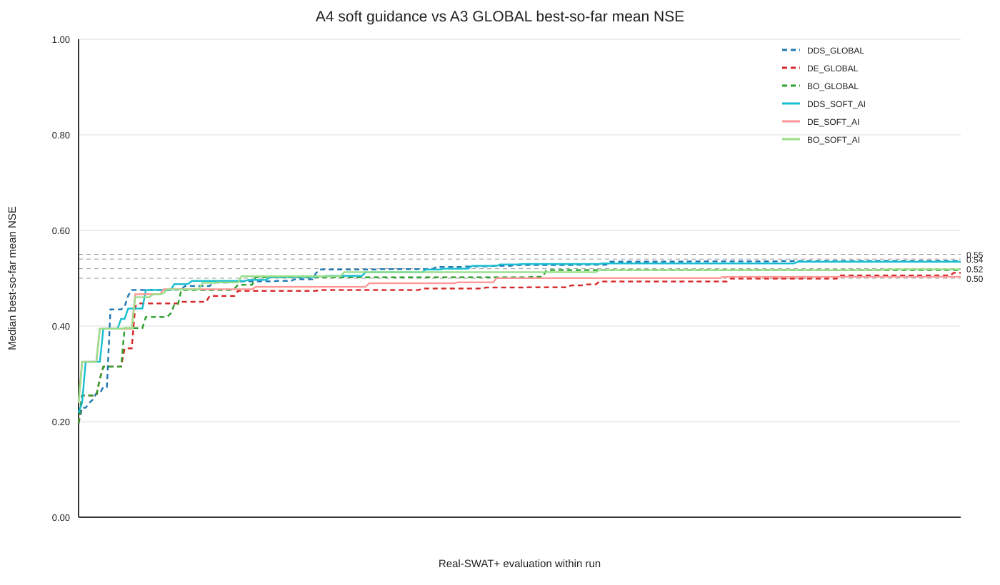

# A4 AI Soft-Guidance Benchmark

## Scope and frozen comparison

A4 tests whether AI should guide initialization and early exploration while the optimizer retains the complete formal 14-dimensional search space. The formal development objective is the three-gauge daily NSE mean over 2003-2016 using SWAT+ rev.62. Validation (2017-2020) and final test (2021-2024) were not loaded.

A4 code baseline: `eb34ec889c6454b8dbe2cdc06e94fd504a384f2a`. The frozen A3 GLOBAL comparison is read-only from `artifacts/a3/results.csv` (SHA-256 `918606146a04765e820bb1a344a60e38c4a2abce5606e1fb3ada64360352e20a`; Gate SHA-256 `a47cad3613adc95f7a309465f68982a7401dbba783d53a589d10fe9c78b7d719`). A3 objective rows were not used to warm-start A4. The frozen A2 region SHA-256 is `b118b549611cf9c065090d1617267ccfa66d86f5f204628a0566393ea3e76d2d`.

## Experimental design

There are nine new runs: DDS_SOFT_AI, DE_SOFT_AI, and BO_SOFT_AI at seeds 20260903, 20260904, and 20260905. Each run has 250 sequential fresh Real-SWAT+ evaluations, for 2250 evaluations total; at most six independent runs execute concurrently with one scratch/work directory and one SWAT process per run.

All candidates live in normalized [0,1]^14 and are mapped to the complete formal bounds for every evaluation. DDS uses the A2 centre for evaluation 1, A2-region sampling through evaluation 16, then standard sequential DDS perturbations clipped only to the formal normalized box. DE uses NP=10 with seven A2-region and three global initialization points; subsequent DE/rand/1/bin mutation and crossover use the full formal box. BO uses 11 A2-region and five global initial-design points, then the fixed A3 BoTorch SingleTaskGP plus LogExpectedImprovement and a 256-point scrambled Sobol pool over the full formal box.

The A2 region is therefore a soft start, not a hard bound. No A2 objective result, A3 objective result, historical optimizer trace, validation observation, or final-test observation enters optimizer state.

## Frozen A2 AI region

| parameter | formal lower | AI lower | AI centre | AI upper | formal upper |
|---|---:|---:|---:|---:|---:|
| cn2 | -20.000000 | -17.269418 | -4.572128 | 5.720605 | 10.000000 |
| latq_co | 0.000000 | 0.000000 | 0.319414 | 0.801633 | 1.000000 |
| lat_ttime | 0.500000 | 0.500000 | 77.979492 | 144.185293 | 180.000000 |
| esco | 0.000000 | 0.186896 | 0.507223 | 0.833574 | 1.000000 |
| epco | 0.000000 | 0.257531 | 0.501815 | 0.992461 | 1.000000 |
| petco | 0.800000 | 0.859954 | 1.087402 | 1.200000 | 1.200000 |
| alpha | 0.000000 | 0.225855 | 0.484892 | 0.916387 | 1.000000 |
| bf_max | 0.100000 | 0.380398 | 1.063010 | 1.450547 | 2.000000 |
| revap_co | 0.020000 | 0.041748 | 0.109752 | 0.158143 | 0.200000 |
| deep_seep | 0.001000 | 0.098700 | 0.221867 | 0.400000 | 0.400000 |
| surlag | 0.050000 | 0.050000 | 11.386323 | 21.008121 | 24.000000 |
| chn | 0.001000 | 0.070258 | 0.154939 | 0.278942 | 0.300000 |
| chk | 0.000010 | 83.164064 | 242.810028 | 426.210936 | 500.000000 |
| perco | 0.800000 | 0.881722 | 0.999805 | 1.100000 | 1.100000 |

## Parallel smoke test

The pre-run smoke test completed `6` independent SWAT work directories with status `PASS`. These six engineering evaluations are excluded from the formal 2250 rows.

## Formal results

The formal table contains `2250` rows, `2250` successful evaluations, `0` failed evaluations, and `9/9` complete runs. It retains each theta, all three station NSE/KGE/PBIAS/RMSE values, mean/min NSE, and best-so-far mean NSE.

A3 GLOBAL values below are the already completed baseline; they are not recomputed in A4.

| arm | best max | best mean ± std | best median | 0.50 median / rate | 0.52 median / rate | 0.54 median / rate | 0.55 median / rate |
|---|---:|---:|---:|---:|---:|---:|---:|
| DDS_GLOBAL | 0.546181 | 0.533611 ± 0.013993 | 0.536119 | 68 / 1.000 | 76 / 0.667 | 90 / 0.333 | NOT_REACHED / 0.000 |
| DE_GLOBAL | 0.525679 | 0.514058 ± 0.010516 | 0.511296 | 216 / 1.000 | 75 / 0.333 | NOT_REACHED / 0.000 | NOT_REACHED / 0.000 |
| BO_GLOBAL | 0.517888 | 0.516251 ± 0.002095 | 0.516974 | 51 / 1.000 | NOT_REACHED / 0.000 | NOT_REACHED / 0.000 | NOT_REACHED / 0.000 |
| DDS_SOFT_AI | 0.556167 | 0.531617 ± 0.026071 | 0.534432 | 55 / 1.000 | 91 / 0.667 | 188 / 0.333 | 188 / 0.333 |
| DE_SOFT_AI | 0.514346 | 0.506757 ± 0.006572 | 0.503017 | 119 / 1.000 | NOT_REACHED / 0.000 | NOT_REACHED / 0.000 | NOT_REACHED / 0.000 |
| BO_SOFT_AI | 0.519844 | 0.518482 ± 0.001441 | 0.518627 | 47 / 1.000 | NOT_REACHED / 0.000 | NOT_REACHED / 0.000 | NOT_REACHED / 0.000 |

### Paired method comparison

A threshold speedup is reported only when both medians reach the threshold; otherwise it remains censored. The predeclared final-precision tolerance is 0.02 NSE in arm maximum best NSE.

| optimizer | GLOBAL max | SOFT_AI max | max delta | GLOBAL→SOFT speedup at 0.50 | at 0.52 | at 0.54 | at 0.55 | final precision ok | method useful |
|---|---:|---:|---:|---:|---:|---:|---:|:---:|:---:|
| DDS | 0.546181 | 0.556167 | 0.009985 | 1.236364 | 0.835165 | 0.478723 | CENSORED | True | True |
| DE | 0.525679 | 0.514346 | -0.011333 | 1.815126 | CENSORED | CENSORED | CENSORED | True | True |
| BO | 0.517888 | 0.519844 | 0.001956 | 1.085106 | CENSORED | CENSORED | CENSORED | True | True |

### Best candidate station NSE

| arm | seed | candidate | best mean NSE | 01605500 NSE | 01606000 NSE | 01606500 NSE |
|---|---:|---|---:|---:|---:|---:|
| DDS_GLOBAL | 20260903 | DDS_GLOBAL_20260903-0242 | 0.546181 | 0.428977 | 0.609752 | 0.599815 |
| DDS_GLOBAL | 20260904 | DDS_GLOBAL_20260904-0226 | 0.536119 | 0.421224 | 0.613242 | 0.573890 |
| DDS_GLOBAL | 20260905 | DDS_GLOBAL_20260905-0244 | 0.518534 | 0.414185 | 0.582535 | 0.558882 |
| DE_GLOBAL | 20260903 | DE_GLOBAL_20260903-0233 | 0.525679 | 0.418687 | 0.607817 | 0.550534 |
| DE_GLOBAL | 20260904 | DE_GLOBAL_20260904-0231 | 0.505198 | 0.407372 | 0.574688 | 0.533534 |
| DE_GLOBAL | 20260905 | DE_GLOBAL_20260905-0248 | 0.511296 | 0.389255 | 0.594914 | 0.549719 |
| BO_GLOBAL | 20260903 | BO_GLOBAL_20260903-0032 | 0.517888 | 0.431386 | 0.588948 | 0.533332 |
| BO_GLOBAL | 20260904 | BO_GLOBAL_20260904-0134 | 0.516974 | 0.402849 | 0.590429 | 0.557645 |
| BO_GLOBAL | 20260905 | BO_GLOBAL_20260905-0217 | 0.513889 | 0.389831 | 0.599905 | 0.551932 |
| DDS_SOFT_AI | 20260903 | DDS_SOFT_AI_20260903-0204 | 0.534432 | 0.416103 | 0.614393 | 0.572801 |
| DDS_SOFT_AI | 20260904 | DDS_SOFT_AI_20260904-0223 | 0.556167 | 0.442837 | 0.620086 | 0.605577 |
| DDS_SOFT_AI | 20260905 | DDS_SOFT_AI_20260905-0124 | 0.504253 | 0.411031 | 0.580450 | 0.521277 |
| DE_SOFT_AI | 20260903 | DE_SOFT_AI_20260903-0230 | 0.514346 | 0.415535 | 0.581565 | 0.545938 |
| DE_SOFT_AI | 20260904 | DE_SOFT_AI_20260904-0183 | 0.502908 | 0.383420 | 0.574886 | 0.550418 |
| DE_SOFT_AI | 20260905 | DE_SOFT_AI_20260905-0243 | 0.503017 | 0.386823 | 0.576741 | 0.545488 |
| BO_SOFT_AI | 20260903 | BO_SOFT_AI_20260903-0229 | 0.519844 | 0.388665 | 0.601709 | 0.569159 |
| BO_SOFT_AI | 20260904 | BO_SOFT_AI_20260904-0134 | 0.516974 | 0.402849 | 0.590429 | 0.557645 |
| BO_SOFT_AI | 20260905 | BO_SOFT_AI_20260905-0148 | 0.518627 | 0.392945 | 0.604955 | 0.557981 |

## Scientific conclusion and Gate

`SOFT_GUIDANCE_EFFECT=STRONG`; `A4_GATE=PASS`.

A method is useful only when SOFT_AI wins at least one paired threshold for at least one seed and its arm maximum best NSE is no more than 0.02 below the A3 GLOBAL arm maximum. STRONG requires all three methods; one or two useful methods are PARTIAL; zero is NONE.

The overall best candidate across the frozen A3 GLOBAL baseline and new A4 SOFT_AI runs is `DDS_SOFT_AI` with mean NSE `0.556167` and station NSE `{"01605500": 0.4428373014954914, "01606000": 0.6200857222638342, "01606500": 0.6055774043104616}`.

A4 ends here. No A5 action, posterior training, validation read, or final-test read is started by this benchmark.

## Artifact boundary

Tracked outputs are `scripts/a4_soft_guidance_benchmark.py`, `artifacts/a4/A4_GATE.json`, `artifacts/a4/results.csv`, this report, and the small SVG curve. Per-run qsim arrays, scratch directories, checkpoints, heartbeats, and smoke logs remain local and are excluded from Git.
