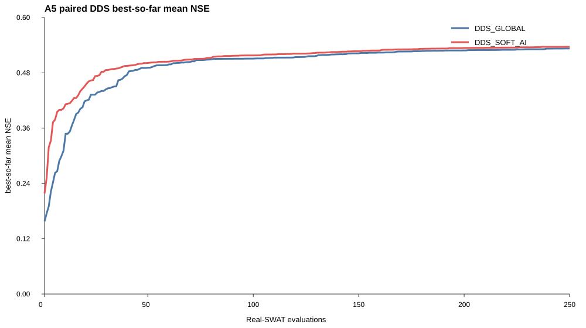

# A5 DDS Confirmatory Benchmark

## Scope and frozen design

A5 is a confirmatory paired benchmark of DDS_GLOBAL versus DDS_SOFT_AI. It uses ten new paired seeds (20260906-20260915), 250 sequential fresh Real-SWAT+ evaluations per arm and seed, 20 runs, and 5000 formal evaluations total.

The code baseline is `ac1c637ab0ad1454a5143cd7a3d31f0318da5f0a`. The development objective is the three-gauge daily NSE mean over 2003-2016 using SWAT+ rev.62. Validation (2017-2020) and final test (2021-2024) were not loaded.

DDS_GLOBAL uses standard sequential DDS in normalized [0,1]^14 mapped to the complete formal 14D bounds. DDS_SOFT_AI exactly reproduces the frozen A4 rule: evaluation 1 is the A2 centre, evaluations 2-16 are A2-region samples, and evaluation 17 onward is standard DDS in the complete formal normalized box. Both arms use DDS sigma 0.2, the same formal bounds, the same objective and the same paired seed list.

No A2/A3/A4 objective result, optimizer trace, validation observation or final-test observation was used to initialize an A5 run.

## Runtime and engineering gate

The formal table contains `5000` rows, `5000` successful evaluations, `0` failed evaluations, and `20/20` complete runs. W6 used at most six independent SWAT work directories/processes. The six-call smoke test had status `PASS` and was excluded from the formal 5000 rows.

## Final best mean NSE

| arm | 10-seed mean | median | std | best across seeds | best candidate |
|---|---:|---:|---:|---:|---|
| DDS_GLOBAL | 0.532901 | 0.534119 | 0.017689 | 0.561959 | DDS_GLOBAL_20260908-0235 |
| DDS_SOFT_AI | 0.536573 | 0.534590 | 0.013816 | 0.564427 | DDS_SOFT_AI_20260910-0218 |

## Threshold performance

The per-seed first-hit evaluation, success rate, and median among reached seeds are reported. `NOT_REACHED` is retained for censored runs.

| arm | threshold | median evaluations | success rate | per-seed first hit |
|---|---:|---:|---:|---|
| DDS_GLOBAL | 0.50 | 80 | 0.900 | 53, 130, 47, 81, 80, 131, 126, NOT_REACHED, 52, 19 |
| DDS_GLOBAL | 0.52 | 116.5 | 0.800 | 102, 202, 62, 131, 159, NOT_REACHED, 239, NOT_REACHED, 70, 32 |
| DDS_GLOBAL | 0.54 | 103.5 | 0.200 | NOT_REACHED, NOT_REACHED, 62, 145, NOT_REACHED, NOT_REACHED, NOT_REACHED, NOT_REACHED, NOT_REACHED, NOT_REACHED |
| DDS_GLOBAL | 0.55 | 111 | 0.200 | NOT_REACHED, NOT_REACHED, 71, 151, NOT_REACHED, NOT_REACHED, NOT_REACHED, NOT_REACHED, NOT_REACHED, NOT_REACHED |
| DDS_SOFT_AI | 0.50 | 51.5 | 1.000 | 30, 111, 104, 46, 21, 66, 48, 62, 55, 28 |
| DDS_SOFT_AI | 0.52 | 86 | 0.900 | 72, NOT_REACHED, 237, 78, 21, 192, 152, 86, 90, 36 |
| DDS_SOFT_AI | 0.54 | 130 | 0.300 | NOT_REACHED, NOT_REACHED, NOT_REACHED, 130, 119, NOT_REACHED, NOT_REACHED, 200, NOT_REACHED, NOT_REACHED |
| DDS_SOFT_AI | 0.55 | 185.5 | 0.200 | NOT_REACHED, NOT_REACHED, NOT_REACHED, 210, 161, NOT_REACHED, NOT_REACHED, NOT_REACHED, NOT_REACHED, NOT_REACHED |

## Anytime performance

AUC is the trapezoidal integral of the best-so-far mean-NSE curve over evaluations 1-250, normalized by 249 evaluations; its unit is therefore comparable to mean NSE. The paired delta is SOFT_AI minus GLOBAL.

| arm | AUC mean | AUC median | AUC std | eval 50 mean | eval 100 mean | eval 150 mean | eval 200 mean | eval 250 mean |
|---|---:|---:|---:|---:|---:|---:|---:|---:|
| DDS_GLOBAL | 0.496446 | 0.496650 | 0.014862 | 0.491079 | 0.510939 | 0.522408 | 0.528693 | 0.532901 |
| DDS_SOFT_AI | 0.510007 | 0.507630 | 0.013817 | 0.501498 | 0.517847 | 0.527081 | 0.534094 | 0.536573 |

Paired AUC delta mean = `0.013561`; median = `0.011181`; paired bootstrap 95% CI = `[0.005620, 0.021620]`.
AUC was higher for SOFT_AI on `8`/10 seeds, tied on `0`, and lower on `2`. Paired final-best delta mean = `0.003672` with bootstrap 95% CI `[-0.010179, 0.017451]`.

## Paired seed results and station-level NSE

| seed | GLOBAL final | SOFT_AI final | delta | GLOBAL AUC | SOFT_AI AUC | AUC delta | GLOBAL best 3-gauge NSE | SOFT_AI best 3-gauge NSE |
|---:|---:|---:|---:|---:|---:|---:|---|---|
| 20260906 | 0.533346 | 0.533912 | 0.000566 | 0.496554 | 0.508380 | 0.011826 | `{"01605500":0.42047116356651715,"01606000":0.6129252812624826,"01606500":0.5666417968785362}` | `{"01605500":0.4199392526727165,"01606000":0.6130087715947752,"01606500":0.5687877605490421}` |
| 20260907 | 0.535527 | 0.519788 | -0.015739 | 0.482588 | 0.491821 | 0.009233 | `{"01605500":0.409354108371748,"01606000":0.6042844323806525,"01606500":0.5929427206958844}` | `{"01605500":0.403730137416198,"01606000":0.5962229088030456,"01606500":0.5594122556534576}` |
| 20260908 | 0.561959 | 0.520411 | -0.041548 | 0.496746 | 0.495160 | -0.001586 | `{"01605500":0.4795383827714067,"01606000":0.6128618813927156,"01606500":0.5934778642706864}` | `{"01605500":0.3951405308794843,"01606000":0.5909635390611112,"01606500":0.575128735451884}` |
| 20260909 | 0.555159 | 0.550346 | -0.004813 | 0.505801 | 0.527535 | 0.021734 | `{"01605500":0.4431470979998089,"01606000":0.6274508890071652,"01606500":0.594878093198979}` | `{"01605500":0.4357655860894172,"01606000":0.6198585948303912,"01606500":0.5954141828913977}` |
| 20260910 | 0.537404 | 0.564427 | 0.027023 | 0.497429 | 0.530632 | 0.033203 | `{"01605500":0.44270160305387685,"01606000":0.605943244264892,"01606500":0.5635669603301376}` | `{"01605500":0.44173164666492193,"01606000":0.6345050786874584,"01606500":0.6170428898054623}` |
| 20260911 | 0.518127 | 0.528039 | 0.009912 | 0.487811 | 0.498347 | 0.010537 | `{"01605500":0.39895598822153067,"01606000":0.5899667901669993,"01606500":0.5654595920058665}` | `{"01605500":0.4100825855613992,"01606000":0.6045305897197422,"01606500":0.5695041438553841}` |
| 20260912 | 0.527427 | 0.535269 | 0.007842 | 0.470333 | 0.501441 | 0.031108 | `{"01605500":0.39870260137971225,"01606000":0.5938881011114683,"01606500":0.5896895260888686}` | `{"01605500":0.4274025877426625,"01606000":0.6098414045372771,"01606500":0.5685629162782481}` |
| 20260913 | 0.498963 | 0.546218 | 0.047255 | 0.492400 | 0.517155 | 0.024755 | `{"01605500":0.3749449573697665,"01606000":0.5720086446720551,"01606500":0.5499351527974718}` | `{"01605500":0.4087577745507037,"01606000":0.6255515053895293,"01606500":0.604344488873871}` |
| 20260914 | 0.526204 | 0.530666 | 0.004463 | 0.512084 | 0.506880 | -0.005204 | `{"01605500":0.40719128371059243,"01606000":0.603528781679546,"01606500":0.5678905649709076}` | `{"01605500":0.43278293417738933,"01606000":0.6033726550010472,"01606500":0.5558432261874197}` |
| 20260915 | 0.534891 | 0.536650 | 0.001759 | 0.522711 | 0.522719 | 0.000008 | `{"01605500":0.4291274686564953,"01606000":0.611240517674859,"01606500":0.5643049476637034}` | `{"01605500":0.4401481645697455,"01606000":0.6096610805624709,"01606500":0.5601409021347286}` |

The best candidate in each arm is reported below to keep the station-level trade-off explicit.

| arm | seed | candidate | mean NSE | min NSE | 01605500 NSE | 01606000 NSE | 01606500 NSE |
|---|---:|---|---:|---:|---:|---:|---:|
| DDS_GLOBAL | 20260906 | DDS_GLOBAL_20260906-0243 | 0.533346 | 0.420471 | 0.420471 | 0.612925 | 0.566642 |
| DDS_GLOBAL | 20260907 | DDS_GLOBAL_20260907-0248 | 0.535527 | 0.409354 | 0.409354 | 0.604284 | 0.592943 |
| DDS_GLOBAL | 20260908 | DDS_GLOBAL_20260908-0235 | 0.561959 | 0.479538 | 0.479538 | 0.612862 | 0.593478 |
| DDS_GLOBAL | 20260909 | DDS_GLOBAL_20260909-0248 | 0.555159 | 0.443147 | 0.443147 | 0.627451 | 0.594878 |
| DDS_GLOBAL | 20260910 | DDS_GLOBAL_20260910-0218 | 0.537404 | 0.442702 | 0.442702 | 0.605943 | 0.563567 |
| DDS_GLOBAL | 20260911 | DDS_GLOBAL_20260911-0247 | 0.518127 | 0.398956 | 0.398956 | 0.589967 | 0.565460 |
| DDS_GLOBAL | 20260912 | DDS_GLOBAL_20260912-0248 | 0.527427 | 0.398703 | 0.398703 | 0.593888 | 0.589690 |
| DDS_GLOBAL | 20260913 | DDS_GLOBAL_20260913-0168 | 0.498963 | 0.374945 | 0.374945 | 0.572009 | 0.549935 |
| DDS_GLOBAL | 20260914 | DDS_GLOBAL_20260914-0170 | 0.526204 | 0.407191 | 0.407191 | 0.603529 | 0.567891 |
| DDS_GLOBAL | 20260915 | DDS_GLOBAL_20260915-0247 | 0.534891 | 0.429127 | 0.429127 | 0.611241 | 0.564305 |
| DDS_SOFT_AI | 20260906 | DDS_SOFT_AI_20260906-0227 | 0.533912 | 0.419939 | 0.419939 | 0.613009 | 0.568788 |
| DDS_SOFT_AI | 20260907 | DDS_SOFT_AI_20260907-0233 | 0.519788 | 0.403730 | 0.403730 | 0.596223 | 0.559412 |
| DDS_SOFT_AI | 20260908 | DDS_SOFT_AI_20260908-0249 | 0.520411 | 0.395141 | 0.395141 | 0.590964 | 0.575129 |
| DDS_SOFT_AI | 20260909 | DDS_SOFT_AI_20260909-0248 | 0.550346 | 0.435766 | 0.435766 | 0.619859 | 0.595414 |
| DDS_SOFT_AI | 20260910 | DDS_SOFT_AI_20260910-0218 | 0.564427 | 0.441732 | 0.441732 | 0.634505 | 0.617043 |
| DDS_SOFT_AI | 20260911 | DDS_SOFT_AI_20260911-0213 | 0.528039 | 0.410083 | 0.410083 | 0.604531 | 0.569504 |
| DDS_SOFT_AI | 20260912 | DDS_SOFT_AI_20260912-0239 | 0.535269 | 0.427403 | 0.427403 | 0.609841 | 0.568563 |
| DDS_SOFT_AI | 20260913 | DDS_SOFT_AI_20260913-0248 | 0.546218 | 0.408758 | 0.408758 | 0.625552 | 0.604344 |
| DDS_SOFT_AI | 20260914 | DDS_SOFT_AI_20260914-0212 | 0.530666 | 0.432783 | 0.432783 | 0.603373 | 0.555843 |
| DDS_SOFT_AI | 20260915 | DDS_SOFT_AI_20260915-0243 | 0.536650 | 0.440148 | 0.440148 | 0.609661 | 0.560141 |

## Confirmatory conclusion and Gate

`CONFIRM_RESULT=PASS`; `A5_GATE=PASS`.

The confirmatory criteria were frozen before execution: (1) paired normalized AUC delta mean is positive and its paired bootstrap 95% CI lower bound is positive; (2) SOFT_AI median evaluations to 0.50 are lower than GLOBAL; and (3) final precision has no stable degradation under the predeclared tolerance and paired-CI rule.

The overall best formal candidate is `DDS_SOFT_AI_20260910-0218` with mean NSE `0.564427` and station NSE `{"01605500":0.44173164666492193,"01606000":0.6345050786874584,"01606500":0.6170428898054623}`.

A5 ends here. No validation/final-test read or subsequent method-tuning action is started by this benchmark.

## Artifact boundary

Tracked outputs are the A5 runner, Gate, results.csv, this report, and the small SVG curve. Per-run qsim arrays, scratch directories, checkpoints, heartbeats and logs remain local and are excluded from Git.
